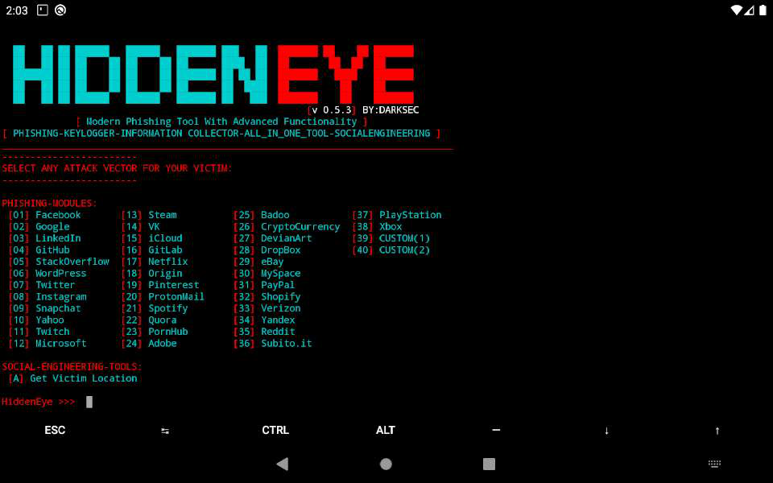

  
 

    

      Modern Phishing Tool With Advanced Functionality 

     PHISHING | KEYLOGGER | INFORMATION_COLLECTOR | ALL_IN_ONE_TOOL | SOCIALENGINEERING  

  
    

# DISCLAIMER

  TO BE USED FOR EDUCATIONAL PURPOSES ONLY

**The use of the HiddenEye is Complete Responsibility of the END-USER. Developers assume no liability and are not responsible for any misuse or damage caused by this program. Please read [LICENSE](LICENSE).**

## DEVELOPERS & CONTRIBUTORS

1) ANONUD4Y (https://github.com/An0nUD4Y)
2) USAMA ABDUL SATTAR (https://github.com/usama7628674)
3) sTiKyt (https://github.com/sTiKyt)
4) UNDEADSEC (https://github.com/UndeadSec)
5) Micrafast (https://github.com/Micrafast)
6) Moltivie (https://github.com/Moltivie)
7) endbehavi0r (https://github.com/endbehavi0r)
8) ___________ (WAITING FOR YOU)

### AVAILABLE TUNNELLING OPTIONS
0) LOCALHOST 
1) LOCALXPOSE (https://localxpose.io)
2) SERVEO (https://serveo.net/)
3) NGROK (https://ngrok.com/)
4) LOCALTUNNEL (Package Version) (https://localtunnel.me)
5) LOCALTUNNEL (Binary Version) (https://www.wa4e.com/downloads/)
6) OPENPORT (https://openport.io/)
7) PAGEKITE (https://pagekite.net/)

### SCREENSHOT

### TESTED ON :-
* **Kali Linux - Rolling Edition**
* **Parrot OS - Rolling Edition**
* **Linux Mint - 18.3 Sylvia**
* **Ubuntu - 16.04.3 LTS**
* **MacOS High Sierra**
* **Arch Linux**
* **Manjaro XFCE Edition 17.1.12**
* **Black Arch**
* **Userland App (For Android Users)**
* **Termux App (For Android Users)**

### PREREQUISITES ( Please verify if you have installed )
* **Python 3**
* **PHP**
* **sudo**

### Find Whats New in This Release - [(FIND HERE)](./Deb/What's-New.md#whats-new)

### FOR FURTHER INSTALLATION PROCEDURE - [(CHECK INSTRUCTIONS)](./Deb/Instructions.md#hiddeneye-installation-guide)

### TEST/CHECK ALL AVAILABLE PHISHING PAGES - [(TEST/CHECK HERE)](./Deb/Test-Phishing.md)

### CREDITS :
* Anonud4y ( I don't remember if i have done Anything )
* Usama ( A Most active Developer)
* sTiKyt ( Guy Who recustomized everything )
* UNDEADSEC (For their wonderful repo socialfish which motivated us a lot)
* TheLinuxChoice ( For His Tools Phishing Pages ) 
* Thewhiteh4t (For Nearyou & Gdrive Location Templates)

# FOUND A BUG ? / HAVE ANY ISSUE ? :- (Read This)
* Check closed & solved issues/bugs before opening new.
* Make sure your issue is related to the codes and resources of this repository.
* Its your responsibility to response on your opened issues.
* If we don't found user response on his/her issue in the particular time interval , Then we have to close that issue.
* Do Not Spam or Advertise & Respect Everyone.

